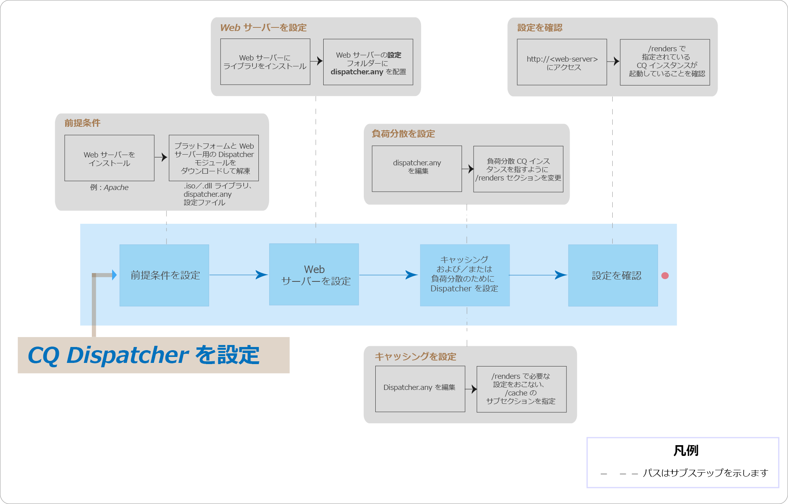

# AEM Dispatcher に関する主な問題とよくある質問



## 概要

### Dispatcher とは？

Dispatcher は、Adobe Experience Managerのキャッシングおよびロードバランシングツールで、高速で動的なWebオーサリング環境を実現するのに役立ちます。キャッシュでは、Dispatcher は Apache などの HTTP サーバーの一部として機能します。これは、できるだけ多くの静的 Web サイトコンテンツを保存（または「キャッシュ」）し、Web サイトのレイアウトエンジンへのアクセスをできるだけ少なくすることを目的としています。ロードバランシングの役割では、Dispatcher はさまざまな AEM インスタンス間でユーザーリクエスト（読み込み）を分散します。

キャッシュ時、Dispatcher モジュールでは Web サーバーの静的コンテンツ提供機能を使用します。キャッシュされたドキュメントは、Dispatcher によって Web サーバーのドキュメントルートに配置されます。

### Dispatcher はどのようにキャッシュを実行しますか。

Dispatcherは、Webサーバーの静的コンテンツを提供する機能を使用します。Dispatcher は、キャッシュされたドキュメントを Web サーバーのドキュメントルートに格納します。Web サイトに変更があったとき、Dispatcher では主に 2 つの方法でキャッシュコンテンツを更新します。

* **コンテンツの更新**&#x200B;によって、変更されたページ、およびそのページに直接関連付けられたファイルを削除します。
* **自動無効化**&#x200B;によって、キャッシュで変更があった部分を自動的に無効化し、更新後に期限切れとします。例えば、関連するページに期限切れのフラグを付けるだけで、削除はおこないません。

### 負荷分散のメリットは何ですか？

負荷分散は、複数のAEMインスタンスに対してユーザーリクエスト（読み込み）を振り分けます。次のリストは、ロードバランシングのメリットを示しています。

* **処理能力の向上**：ロードバランシングを実行すると、Dispatcher と AEM の複数のインスタンスでドキュメント要求が共有されます。各インスタンスで処理するドキュメントの数が少なくなるので、応答時間を短縮できます。Dispatcher はドキュメントカテゴリごとに内部統計を保持するので、負荷を予測してクエリを効率的に分散させることができます。
* **フェイルセーフ対象の拡大**：インスタンスからの応答が受信されない場合、Dispatcher は自動的に要求を他のいずれかのインスタンスにリレーします。したがって、1 つのインスタンスが無効になった場合の影響は、計算能力の低下と比例してサイトの処理が遅くなることだけです。

>[!NOTE]
>
>詳しくは、[Dispatcher の概要](dispatcher.md)ページを参照してください。

## インストールおよび設定

### Dispatcher モジュールはどこからダウンロードできますか？

最新の Dispatcher モジュールは、[Dispatcher リリースノート](release-notes.md)ページからダウンローできます。

### Dispatcher モジュールのインストール方法を教えてください。

Dispatcher の[インストール](dispatcher-install.md)ページを参照してください。

### Dispatcher モジュールの設定方法を教えてください。

[Dispatcher 設定](dispatcher-configuration.md)ページを参照してください。

### オーサーインスタンス用に Dispatcher を設定する方法を教えてください。

詳細な手順については、[オーサーインスタンスでの Dispatcher の使用](dispatcher.md#using-a-dispatcher-with-an-author-server)を参照してください。

### を複数のドメインで Dispatcher 設定する方法を教えてください。

ドメインが次の条件を満たしている場合、複数のドメインで CQ Dispatcher を設定できます。

* 両方のドメイン用の Web コンテンツが単一の AEM リポジトリに保存されている
* Dispatcher キャッシュ内のファイルをドメインごとに個別に無効化できる

詳しくは、[複数ドメインでの Dispatcher の使用](dispatcher-domains.md)を参照してください。

### ユーザーからのすべての要求が同じ パブリッシュインスタンスにルーティングされるように Dispatcher を設定する方法を教えてください。

[スティッキー接続](dispatcher-configuration.md#identifying-a-sticky-connection-folder-stickyconnectionsfor)機能を使用すると、ユーザーのすべてのドキュメントが AEM の同じインスタンス上で処理されるようになります。この機能は、パーソナライズされたページとセッションデータを使用する場合に重要です。データはインスタンスに保存されます。そのため、以降の同じユーザーからの要求は、同じインスタンスに返す必要があります。

スティッキー接続をおこなうと、Dispatcher で要求を最適化する機能が制限されるので、このアプローチはは必要な場合にのみ使用してください。「スティッキー」ドキュメントを保存するフォルダーは指定できるので、そのフォルダー内のすべてのドキュメントをユーザーごとに同じインスタンス上で処理できます。

### スティッキー接続とキャッシュを組み合わせることはできますか？

スティッキー接続を使用するほとんどのページでは、キャッシュをオフにする必要があります。そうしないと、セッションコンテンツに関係なく、ページの同じインスタンスがすべてのユーザーに表示されます。

一部のアプリケーションでは、スティッキー接続とキャッシュの両方を使用できます。例えば、データをセッションに書き込むフォームを表示する場合、スティッキー接続とキャッシュを組み合わせて使用できます。

### Dispatcher とAEM パブリッシュインスタンスは同じ物理マシンに配置できますか？

マシンの性能が十分でれば可能です。ただし、異なるマシン上に Dispatcher および AEM パブリッシュインスタンスを設定することをお勧めします。

通常、パブリッシュインスタンスはファイアウォール内に存在し、DispatcherはDMZに存在します。 同じ物理マシンにパブリッシュインスタンスと Dispatcher の両方を配置することを決定した場合は、ファイアウォール設定で外部ネットワークからパブリッシュインスタンスへの直接アクセスが禁止されていること確認してください。

### 特定の拡張子を持つファイルのみキャッシュできますか？

はい。例えば、GIF ファイルのみをキャッシュする場合は、dispatcher. any 設定ファイルのキャッシュセクションで「*. gif」と指定します。

### キャッシュからファイルを削除する方法を教えてください。

HTTP リクエストを使用して、キャッシュからファイルを削除できます。HTTP リクエストを受信すると、Dispatcher はキャッシュからファイルを削除します。Dispatcher は、そのページに対するクライアント要求を受信した場合にのみ、ファイルを再びキャッシュします。このようなやり方でキャッシュファイルを削除する方法は、同じページに対する要求を同時に受信する可能性が低い Web サイトに適しています。

HTTP 要求の構文は以下のとおりです。

```
POST /dispatcher/invalidate.cache HTTP/1.1
CQ-Action: Activate
CQ-Handle: path-pattern
Content-Length: 0
```

Dispatcher は、CQ-Handle ヘッダーの値に一致する名前を持つ、キャッシュされたファイルおよびフォルダーを削除します。例えば、`/content/geomtrixx-outdoors/en` という CQ-Handle は、以下のアイテムに一致します。

geometrixx-outdoors directory ディレクトリ内の という名前を持つ（あらゆるファイル拡張子の）すべてのファイル
en ディレクトリ（存在する場合、キャッシュされたページのサブノードのレンダリングを格納）の下にある「`_jcr_content`」という名前のすべてのディレクトリ
ディレクトリ en は、`CQ-Action` が `Delete` または `Deactivate` である場合のみ削除されます。

このトピックの詳細については、[手動での Dispatcher キャッシュの無効化](page-invalidate.md)を参照してください。

### 権限に影響を受けるキャッシュの実装について教えてください。

[セキュリティ保護されたコンテンツのキャッシュ](permissions-cache.md)ページを参照してください。

### Dispatcher インスタンスと CQ インスタンス間の通信を保護する方法を教えてください。

[Dispatcherのセキュリティチェックリスト](security-checklist.md)と[AEMのセキュリティチェックリスト](https://helpx.adobe.com/jp/experience-manager/6-4/sites/administering/using/security-checklist.html)のページを参照してください。

### Dispatcher の問題：`jcr:content` が `jcr%3acontent` に変更される

**質問**：最近、CQ レポジトリからデータを取得する Ajax コードの 1 つに `jcr:content` が含まれていて、それが `jcr%3acontent` にエンコードされたため、結果セットが誤ったものになるという Dispatcher レベルの問題が発生しました。

**回答**:メソッドを使 `ResourceResolver.map()` 用して、リクエストの取得で使用または発行される「わかりやすいURL」を取得し、Dispatcherのキャッシュの問題を解決してください。map()メソッドは、 `:`コロンをアンダースコアにエンコードし、 resolve()メソッドはそれらをSLING JCRで読み取り可能な形式に戻します。Ajax呼び出しで使用するURLを生成するには、 map()メソッドを使用する必要があります。

詳細はこちらを参照：[https://sling.apache.org/documentation/the-sling-engine/mappings-for-resource-resolution.html#namespace-mangling](https://sling.apache.org/documentation/the-sling-engine/mappings-for-resource-resolution.html#namespace-mangling)

## Dispatcher をフラッシュする

### パブリッシュインスタンスで Dispatcher フラッシュエージェントを設定する方法を教えてください。

[レプリケーション](https://helpx.adobe.com/content/help/en/experience-manager/6-4/sites/deploying/using/replication.html#ConfiguringyourReplicationAgents)ページを参照してください。

### Dispatcher のフラッシュ問題のトラブルシューティング方法を教えてください。

[次の質問に答える、このトラ](https://helpx.adobe.com/content/help/en/experience-manager/kb/troubleshooting-dispatcher-flushing-issues.html) ブルシューティング記事を参照してください。

* Dispatcher キャッシュにコンテンツが保存されていない状況をデバッグするにはどうすればよいですか？
* キャッシュファイルが更新されない状況をデバッグするにはどうすればよいですか？
* Dispatcherフラッシュに関連しない状況をデバッグする方法を教えてください。

削除操作によって Dispatcher がフラッシュされる場合は、[Sensei Martin によるコミュニティブログの投稿に記載された回避策（](https://mkalugin-cq.blogspot.in/2012/04/i-have-been-working-on-following.html)）を使用してください。

### Dispatcher キャッシュから DAM アセットをフラッシュする方法を教えてください。

「チェーンレプリケーション」機能を使用できます。この機能を有効にすると、オーサーから複製を受信したとき、Dispatcher フラッシュエージェントがフラッシュリクエストを送信します。

有効にするには：

1. [この手順に従って](page-invalidate.md#invalidating-dispatcher-cache-from-a-publishing-instance)、パブリッシュ時にエージェントをフラッシュします
1. これらのエージェントの設定に移動し、「**トリガー**」タブで「**受信時**」ボックスにチェックします。

## その他

Dispatcher はドキュメントが最新かどうかをどう判断しますか？ドキュメントが最新かどうかを判断するために、Dispatcher は次の手順を実行します。

ドキュメントが自動無効化の対象であるかどうかチェックします。対象でない場合、ドキュメントは最新であると認識されます。ドキュメントが自動無効化の対象として設定されている場合、Dispatcher は最新の変更情報と比べてドキュメントが古いかどうかチェックします。ドキュメントが古い場合、Dispatcher は AEM インスタンスに最新バージョンを要求し、キャッシュ内のバージョンを置き換えます。

### Dispatcher はどのようにドキュメントを返しますか？

[Dispatcher 設定](dispatcher-configuration.md)ファイル `dispatcher.any` を使用して、Dispatcher がドキュメントをキャッシュするかどうかを定義できます。Dispatcher は、要求とキャッシュ可能なドキュメントのリストを照合します。ドキュメントがこのリストにない場合は、AEM インスタンスにドキュメントを要求します。

`/rules` プロパティは、ドキュメントパスに応じてキャッシュされるドキュメントを制御します。`/rules` プロパティにかかわらず、Dispatcher は以下の状況にあるドキュメントをキャッシュしません。

* 要求 URI に疑問符（「`(?)`」）が含まれている場合。
* 疑問符は通常、キャッシュの必要がない、検索結果などの動的ページを指します。
* ファイル拡張子が不明の場合。
* Web サーバーでドキュメントのタイプ（MIME タイプ）を判別するために、拡張子が必要です。
* 認証ヘッダー（設定可）が設定されている場合。
* AEM インスタンスが以下のヘッダーで応答する場合。
   * no-cache
   * no-store
   * must-revalidate

Dispatcher はキャッシュされたファイルを、静的 Web サイトに含まれる場合と同様に、Web サーバー上に格納しています。ユーザーがキャッシュ可能なドキュメントを要求すると、Dispatcher はそのドキュメントが Web サーバーのファイルシステムに存在するかどうかをチェックします。ファイルシステムに存在する場合、Dispatcher はそのドキュメントを返します。ドキュメントがキャッシュされていない場合、Dispatcher は AEM インスタンスにドキュメントを要求します。

>[!NOTE]
>
>（HTTP ヘッダー用の）GET または HEAD メソッドは、Dispatcher によってキャッシュ可能です。応答ヘッダーのキャッシュについて詳しくは、[HTTP 応答ヘッダーのキャッシュ](dispatcher-configuration.md#caching-http-response-headers)セクションを参照してください。

### 複数の Dispatchers を 1 つのシステムに実装できますか。

はい。そのような場合は、Dispatcher が AEM Web サイトに直接アクセスできることを確認してください。Dispatcher は、別の Dispatcher からの要求を処理できません。
