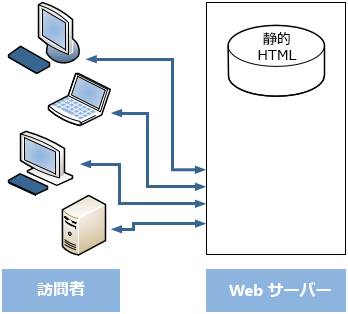
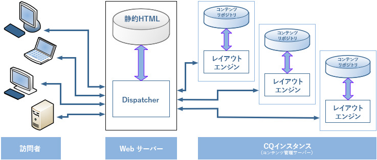

# Dispatcher の概要 {#dispatcher-overview}

>[!NOTE]
>
>Dispatcher のバージョンは、AEM（Adobe Experience Manager）とは無関係です。 Dispatcher のドキュメントへのリンクをたどると、このページにリダイレクトされる可能性があります。 このリンクは、旧バージョンの AEM のドキュメントに埋め込まれていたものです。

Dispatcher は、Adobe Experience Manager のキャッシュやロードバランシングツールで、企業向けの web サーバーと組み合わせて使用します。

Dispatcher をデプロイするプロセスは、選択した web サーバーや OS プラットフォームに依存しません。

1. Dispatcher について学習します（このページ）。[Dispatcher に関するよくある質問](/help/using/dispatcher-faq.md)も参照してください。
1. Web サーバーのドキュメントに従って、[サポートされている Web サーバー](https://experienceleague.adobe.com/ja/docs/experience-manager-65/content/implementing/deploying/introduction/technical-requirements)をインストールします。
1. Web サーバーに [Dispatcher モジュールをインストール](dispatcher-install.md)し、このモジュールに合わせて Web サーバーを設定します。
1. [Dispatcher を設定](dispatcher-configuration.md)します（dispatcher.any ファイル）。
1. コンテンツの更新によってキャッシュが無効化されるように [AEM を設定](page-invalidate.md)します。

>[!NOTE]
>
>Dispatcher と AEM の連携の仕組みをより深く理解するには、以下を参照してください。
>
>* 詳しくは、[2017 年 7 月の AEM コミュニティエキスパートへの質問](https://communities.adobeconnect.com/pf0gem7igw1f/)を参照してください。
>* [このリポジトリ](https://github.com/adobe/aem-dispatcher-experiments)にアクセスします。実験のコレクションを「テイクホーム」ラボ形式で収蔵しています。


必要に応じて、次の情報を使用します。

* [Dispatcher のセキュリティチェックリスト](security-checklist.md)
<!-- URL is 404! * [The Dispatcher Knowledge Base](https://helpx.adobe.com/experience-manager/kb/index/dispatcher.html) -->
* [Web サイトのキャッシュパフォーマンスの最適化](https://experienceleague.adobe.com/ja/docs/experience-manager-65/content/implementing/deploying/configuring/configuring-performance)
* [複数ドメインでの Dispatcher の使用](dispatcher-domains.md)
* [Dispatcher での SSL の使用](dispatcher-ssl.md)
* [権限に影響を受けるキャッシュの実装](permissions-cache.md)
* [Dispatcher に関する問題のトラブルシューティング](dispatcher-troubleshooting.md)
* [Dispatcher に関する主な問題とよくある質問](dispatcher-faq.md)

>[!NOTE]
>
>**Dispatcher の最も一般的な使用法**&#x200B;は、AEM **パブリッシュインスタンス**&#x200B;からの応答をキャッシュして、外部に公開されている Web サイトの応答性とセキュリティを高めることです。したがって、大部分の説明ではこのケースを想定しています。
>
>ただし、Dispatcher を使用して&#x200B;**オーサーインスタンス**&#x200B;の応答性を高めることもできます。これは、特に、多数のユーザーが web サイトを編集および更新する場合に当てはまります。このケースについて詳しくは、以下の[オーサーサーバーでの Dispatcher の使用](#using-a-dispatcher-with-an-author-server)を参照してください。

## Dispatcher を使用してキャッシュを実装する理由？ {#why-use-dispatcher-to-implement-caching}

Web パブリッシングには、次の 2 つの基本的な方法があります。

* **静的 Web サーバー**：Apache や IIS などはシンプルですが、高速です。
* **コンテンツ管理サーバー**：動的で、リアルタイムの、インテリジェントなコンテンツですが、より多くの計算時間とその他のリソースを必要とします。

Dispatcher によって、高速かつ動的な環境を実現できます。Apache のような静的 HTML サーバーの一部として機能し、次の目的を達成します。

* できるだけ多くのサイトコンテンツを、静的 Web サイトの形式で格納（キャッシュ）します。
* レイアウトエンジンへのアクセスをできるだけ少なくします。

つまり、次のようになります。

* **静的コンテンツ**&#x200B;は、静的 web サーバーと同じ速度で簡単に処理できます。また、静的 web サーバーで使用できる管理ツールとセキュリティツールを使用できます。

* 必要に応じて&#x200B;**動的コンテンツ**&#x200B;を生成できます。このとき、システムの動作が必要以上に遅くなることはありません。

Dispatcher には、動的サイトのコンテンツに基づいて静的 HTML を生成し、更新するメカニズムが含まれています。静的ファイルとして保存するドキュメントと、常に動的に生成されるドキュメントを詳細に指定できます。

この節では、このプロセスの原則について説明します。

### 静的 web サーバー {#static-web-server}



Apache や IIS などの静的 web サーバーは、web サイトの訪問者に静的 HTML ファイルを提供します。静的ページは 1 回だけ作成されるので、リクエストごとに同じコンテンツが配信されます。

このプロセスは簡単で効率的です。訪問者が HTML ページなどのファイルをリクエストすると、ファイルはメモリから直接取得され、最悪の場合でもローカルドライブから読み取られます。静的 web サーバーはかなり前から利用されてきました。そのため、管理とセキュリティ管理のための様々なツールが用意されています。これらのツールは、ネットワークインフラストラクチャとよく統合されています。

### コンテンツ管理サーバー {#content-management-servers}


AEM などの CMS（コンテンツ管理サーバー）を使用する場合、訪問者からのリクエストは高度なレイアウトエンジンによって処理されます。このエンジンは、リポジトリからコンテンツを読み取り、スタイル、フォーマットおよびアクセス権を組み合わせて、コンテンツを訪問者のニーズや権限に合わせたドキュメントに変換します。

このワークフローによって、豊富で動的なコンテンツを作成でき、web サイトの柔軟性と機能性を高めることができます。ただし、レイアウトエンジンは静的サーバーより多くの処理能力が必要なので、レイアウトエンジンを設定すると、多くの訪問者がシステムを使用した場合に動作が遅くなる可能性があります。

## Dispatcher によるキャッシュの実行方法 {#how-dispatcher-performs-caching}


**キャッシュディレクトリ**：キャッシュ時、Dispatcher モジュールでは web サーバーの静的コンテンツ提供機能を使用します。キャッシュされたドキュメントは、Dispatcher によって web サーバーのルートに配置されます。

>[!NOTE]
>
>HTTP ヘッダーキャッシュの設定がない場合、Dispatcher は、ページの HTML コードのみを保存します。この場合、HTTP ヘッダーは保存されません。Web サイト内で異なるエンコーディングを使用していると、これらのページが失われる可能性があるので、このシナリオは問題になる可能性があります。HTTP ヘッダーキャッシュを有効にするには、[Dispatcher キャッシュの設定](https://experienceleague.adobe.com/ja/docs/experience-manager-dispatcher/using/configuring/dispatcher-configuration)を参照してください。

>[!NOTE]
>
>Web サーバーのドキュメントルートをネットワーク接続ストレージ（NAS）上に配置すると、パフォーマンスが低下します。また、NAS 上のドキュメントルートを複数の web サーバーで共有すると、レプリケーションアクションの実行時に断続的なロックが発生することがあります。

>[!NOTE]
>
>Dispatcher は、キャッシュされたドキュメントを、リクエストされた URL と等しい構造に保存します。
>
>ファイル名の長さには OS レベルでの制限がある場合があります。つまり、多数のセレクターを含む URL がある場合です。

### キャッシュの方法

Web サイトに変更があったとき、Dispatcher では主に 2 つの方法でキャッシュコンテンツを更新します。

* **コンテンツの更新**&#x200B;によって、変更されたページや、そのページに直接関連付けられたファイルを削除します。
* **自動無効化**&#x200B;によって、キャッシュで変更があった部分を自動的に無効化し、更新後に期限切れとします。つまり、関連するページに期限切れのフラグを付けるだけで、削除は行いません。

### コンテンツの更新

コンテンツの更新時に、1 つ以上の AEM ドキュメントが変更されます。AEM から Dispatcher にシンジケーションのリクエストが送信され、このリクエストに応じて次のようにキャッシュの更新が行われます。

1. 変更されたファイルを、キャッシュから削除します。
1. 同じハンドルで始まるすべてのファイルを、キャッシュから削除します。例えば、ファイル `/en/index.html` が更新された場合、`/en/index.` で始まるすべてのファイルは削除されます。このメカニズムによって、特に画像ナビゲーションの場合に、キャッシュを効率的に使用するサイトをデザインできます。
1. **statfile** と呼ばれるファイルに&#x200B;*アクセス*&#x200B;します。アクセスすると、statfile のタイムスタンプが最終変更日に更新されます。

次の点に注意してください。

* コンテンツの更新は、通常、置き換える必要のあるコンテンツを「把握している」オーサリングシステムと組み合わせて使用します。
* コンテンツの更新が適用されたファイルは削除されますが、すぐに置き換えられるわけではありません。そのようなファイルが次回リクエストされると、DispatcherはAEM インスタンスから新しいファイルを取得してキャッシュに配置し、古いコンテンツを上書きします。
* 通常、ページのテキストを取り込んで自動生成された画像は、同じハンドルで始まる画像ファイルに格納されます。したがって、ページと画像ファイルは関連があり、削除の対象となります。例えば、mypage.html というページのタイトルテキストを、mypage.titlePicture.gif ファイルとして同じフォルダーに格納できます。したがって、ページの更新ごとにキャッシュにある画像が自動的に削除されるので、画像のバージョンを常にページの現在のバージョンと合わせることができます。
* statfile は複数持つことができます。例えば、言語フォルダーごとに 1 つずつ持つことができます。ページが更新されると、AEM は statfile を含む次の親フォルダーを探し、そのファイルに *touch* します。

### 自動無効化

自動無効化は、キャッシュのパーツを自動的に無効化するもので、ファイル自体の削除は行いません。コンテンツの更新ごとに statfile と呼ばれるファイルに touch するので、statfile のタイムスタンプは最終更新日を示します。

Dispatcher は、自動無効化の対象となるファイルのリストを保持しています。このリストにあるドキュメントが要求されると、Dispatcher はキャッシュされたドキュメントの日付と statfile のタイムスタンプを比較します。

* キャッシュされたドキュメントのほうが新しい場合、そのドキュメントを返します。
* キャッシュされたドキュメントのほうが古い場合、Dispatcher は AEM インスタンスから現在のバージョンを取得します。

この場合も、注意すべきポイントがいくつかあります。

* 自動無効化は通常、HTML ページなど相互関係が複雑な場合に使用します。このようなページには、リンクやナビゲーションエントリが含まれるので、通常はコンテンツの更新後にこれらのリンクなどを更新する必要があります。自動生成される PDF や画像ファイルがある場合も、これらのファイルに対して自動無効化を選択できます。
* 自動無効化の機能は、statfile にアクセスする以外は、更新時の Dispatcher の動作に関与しません。ただし、statfile にアクセスすると、そのキャッシュコンテンツは自動的に古い情報とみなしますが、キャッシュから物理的に削除されるわけではありません。

## Dispatcher がドキュメントを返す方法 {#how-dispatcher-returns-documents}


### ドキュメントがキャッシュの対象かどうかの判断

[どのドキュメントを Dispatcher でキャッシュするかは設定ファイルで定義](https://experienceleague.adobe.com/ja/docs/experience-manager-dispatcher/using/configuring/dispatcher-configuration)できます。Dispatcher は、要求とキャッシュ可能なドキュメントのリストを照合します。ドキュメントがこのリストにない場合は、AEM インスタンスにドキュメントを要求します。

以下の場合、Dispatcher は常に AEM インスタンスに直接ドキュメントを要求します。

* リクエスト URI に疑問符（`?`）が含まれている場合。このシナリオは通常、キャッシュの必要がない、検索結果などの動的ページを指します。
* ファイル拡張子が不明の場合。Web サーバーでドキュメントのタイプ（MIME タイプ）を判別するために、拡張子が必要です。
* 認証ヘッダーが設定されている（設定可能）場合。

>[!NOTE]
>
>（HTTP ヘッダー用の）GET または HEAD メソッドは、Dispatcher によってキャッシュ可能です。 応答ヘッダーのキャッシュについて詳しくは、[HTTP 応答ヘッダーのキャッシュ](https://experienceleague.adobe.com/ja/docs/experience-manager-dispatcher/using/configuring/dispatcher-configuration)セクションを参照してください。

### ドキュメントがキャッシュされているかどうかの判断

Dispatcher はキャッシュされたファイルを、静的 Web サイトに含まれる場合と同様に、Web サーバー上に格納しています。ユーザーがキャッシュ可能なドキュメントを要求すると、Dispatcher はそのドキュメントが web サーバーのファイルシステムに存在するかどうかを確認します。

* ドキュメントがキャッシュされている場合、Dispatcher はそのファイルを返します。
* ドキュメントがキャッシュされていない場合、Dispatcher は AEM インスタンスにドキュメントを要求します。

### ドキュメントが最新かどうかの判断

ドキュメントが最新かどうかを判断するために、Dispatcher は次の 2 つの手順を実行します。

1. ドキュメントが自動無効化の対象であるかどうかチェックします。そうでない場合、ドキュメントは最新と見なされます。
1. ドキュメントが自動無効化の対象として設定されている場合、Dispatcher は最新の変更情報と比べてドキュメントが古いかどうかチェックします。ドキュメントが古い場合、Dispatcher は AEM インスタンスに最新バージョンを要求し、キャッシュ内のバージョンを置き換えます。

>[!NOTE]
>
>**自動無効化**&#x200B;の対象でないドキュメントは、物理的に削除されるまでキャッシュに残ります。例えば、web サイト上のコンテンツ更新などです。

## ロードバランシングのメリット {#the-benefits-of-load-balancing}

ロードバランシングとは、Web サイトの計算負荷を AEM の複数のインスタンスに分散させることです。



以下のようなメリットがあります。

* **処理能力の向上**
実際には、処理能力の向上は、Dispatcher が複数の AEM インスタンス間でドキュメントリクエストを共有することです。各インスタンスで処理するドキュメントの数が少なくなるので、応答時間を短縮できます。Dispatcher はドキュメントカテゴリごとに内部統計を保持するので、負荷を予測してクエリを効率的に分散させることができます。

* **フェールセーフ範囲の拡大**
インスタンスからの応答が受信されない場合、Dispatcher はリクエストを他のいずれかのインスタンスに自動的にリレーします。あるインスタンスが無効になった場合は、計算能力の低下と比例してサイトの処理が遅くなること以外に影響はありません。サービスはすべて続行します。

* 同じ静的 web サーバー上で異なる web サイトを管理することもできます。

>[!NOTE]
>
>ロードバランシングによって負荷を効率的に分散させる一方、キャッシュによって負荷を減らすことができます。したがって、アップロードバランシングを設定する前に、キャッシュを最適化して全体の負荷を減らしてみてください。キャッシュを最適化することで、ロードバランサーのパフォーマンスを向上させたり、ロードバランシングを不要にしたりできます。

>[!CAUTION]
>
>単一の Dispatcher では、使用可能パブリッシュインスタンスの容量が飽和状態になる可能性がありますが、一部のアプリケーションでは、2 つの Dispatcher インスタンス間でロードバランシングを行うとよい場合が稀にあります。複数の Dispatcher を持つ設定については、慎重に検討する必要があります。Dispatcher を追加すると、使用可能なパブリッシュインスタンスの負荷が大きくなり、ほとんどのアプリケーションでパフォーマンスが低下しやすくなるからです。

## Dispatcher によるロードバランシングの実行方法 {#how-the-dispatcher-performs-load-balancing}

### パフォーマンス統計

Dispatcher は、AEM の各インスタンスのドキュメント処理速度についての内部統計を保持しています。このデータに基づき、Dispatcher はリクエストに回答する際、応答時間が最も速いインスタンスを予測し、そのインスタンスで必要な計算時間を確保します。

リクエストのタイプによって平均完了時間も変わるので、Dispatcher ではドキュメントのカテゴリを指定できます。これらのカテゴリは、予測時間の計算時に考慮されます。例えば、HTML ページと画像とでは標準的な応答時間が異なることが多いので、この両者を区別することができます。

詳細な検索機能を使用する場合は、検索クエリのカテゴリを作成できます。この方法により、応答の最も速いインスタンスに検索クエリを送信できます。また、他のインスタンスが「低負荷」のリクストを受信している間に、低速のインスタンスがいくつかの「高負荷」の検索クエリを受信して、停止するのを防ぐのにも役立ちます。

### 個人設定されたコンテンツ（スティッキー接続）

スティッキー接続では、1 人のユーザーに対するドキュメントが、常に AEM の同じインスタンス上で構成されるようにします。この点は、パーソナライズされたページとセッションデータを使用する場合に重要です。データはインスタンスに格納されるので、以降の同じユーザーからの要求は、同じインスタンスに返す必要があります。

スティッキー接続では、Dispatcher でリクエストを最適化する機能が制限されるので、このアプローチはは必要な場合にのみ使用してください。「スティッキー」ドキュメントを保存するフォルダーは指定できるので、そのフォルダー内のすべてのドキュメントをユーザーごとに同じインスタンスに構成できます。

>[!NOTE]
>
>スティッキー接続を使用するページでは、ほとんどの場合、キャッシュをオフにする必要があります。オフにしないと、セッション内容に関わらず、ページがすべてのユーザーに同じように表示されます。
>
>*一部*&#x200B;のアプリケーションで、スティッキー接続とキャッシュの併用が可能な場合があります。例えば、セッションにデータを書き込むためのフォームを表示する場合です。

## 複数の Dispatcher の使用 {#using-multiple-dispatchers}

複雑な設定を行う場合は、複数の Dispatcher を使用できます。 例えば、次のように使用できます。

* 1 つ目の Dispatcher を、イントラネット上での web サイトの公開に使用
* 2 つ目の Dispatcher を、異なるアドレスと異なるセキュリティ設定で、インターネット上での同じコンテンツの公開に使用

この場合、各要求が経由する Dispatcher は 1 つだけにしてください。 別の Dispatcher から渡された要求は処理されません。 したがって、どちらの Dispatcher も AEM web サイトに直接アクセスするようにしてください。

## CDN での Dispatcher の使用 {#using-dispatcher-with-a-cdn}

Akamai Edge Delivery または Amazon Cloud Front などのコンテンツ配信ネットワーク（CDN）は、エンドユーザーに近い場所からコンテンツを配信します。そのため、以下のことが可能です。

* エンドユーザーに対する応答時間をスピードアップする
* サーバーから負荷を取り除く

HTTP インフラストラクチャコンポーネントとして、CDN は Dispatcher と同様に機能します。CDN ノードがリクエストを受け取ると、可能な場合（リソースはキャッシュ内にあって有効な場合）はキャッシュからリクエストを提供します。それ以外の場合は、次に近いサーバーに問い合わせてリソースを取得し、適切であれば、今後のリクエストに備えてキャッシュします。

「次に最も近いサーバー」は、特定の設定に応じて異なります。例えば、Akamai の設定では、要求は次のパスをたどることができます。

* Akamai Edge Node
* Akamai Midgres レイヤー
* ファイアウォール
* ロードバランサー
* Dispatcher
* AEM

通常、Dispatcher が次のサーバーとなり、キャッシュからドキュメントを提供し、CDN サーバーに返される応答ヘッダーに影響を与えます。

## CDN キャッシュの制御 {#controlling-a-cdn-cache}

CDN が Dispatcher から再取得するまでのリソースのキャッシュ期間を制御するには、いくつかの方法があります。

1. 明確な設定。
MIME タイプ、拡張子、リクエストタイプなどに応じて、特定のリソースを CDN のキャッシュに保持する期間を設定します。

1. 有効期限およびキャッシュ制御ヘッダー。
ほとんどの CDN は、アップストリームサーバーから送信される場合に、HTTP ヘッダー `Expires:` および `Cache-Control:` を保持します。この方法は、例えば、Apache モジュール [mod_expires](https://httpd.apache.org/docs/2.4/mod/mod_expires.html?lang=ja) を使用するなどして実行できます。

1. 手動での無効化。
CDN では、Web インターフェイスを使用してリソースをキャッシュから削除できます。
1. API ベースの無効化。\
   ほとんどの CDN には、リソースをキャッシュから削除できる REST または SOAP API も用意されています。

一般的な AEM 設定では、上記の 1 および 2 の方法で実行できる、拡張子別設定、パス別設定またはその両方の設定を使用して、適切なキャッシング期間を設定できます。これらのキャッシュ期間は、デザイン画像やクライアントライブラリなど、よく使用されるが頻繁には変更されないリソースを対象としています。新しいリリースがデプロイされると、一般的には手動での無効化が必要になります。

キャッシュで管理されているコンテンツに対してこの手法を使用した場合は、コンテンツの変更がエンドユーザーに表示されるのは、設定されているキャッシュ期間の有効期限が切れたときだけです。また、ドキュメントが Dispatcher から再度取得された場合も同様です。

よりきめ細かな制御を行うために、API ベースの無効化を使用して、Dispatcher のキャッシュが無効になったら CDN のキャッシュを無効化することができます。CDN の API に基づいて、独自の [ContentBuilder](https://developer.adobe.com/experience-manager/reference-materials/6-5/javadoc/com/day/cq/replication/ContentBuilder.html?lang=ja) と [TransportHandler](https://developer.adobe.com/experience-manager/reference-materials/6-5/javadoc/com/day/cq/replication/TransportHandler.html?lang=ja)（API が REST ベースではない場合）を実装し、これらを使用して CDN のキャッシュを無効化するレプリケーションエージェントを設定できます。

>[!NOTE]
>
>[AEM (CQ) Dispatcher Security and CDN+Browser Caching](https://www.slideshare.net/andrewmkhoury/dispatcher-caching-aemgemspart2jan2015) および [Dispatcher のキャッシュ](https://experienceleague.adobe.com/ja/docs/events/experience-manager-gems-recordings/gems2015/aem-dispatcher-caching-new-features-and-optimizations)に関する録画済みのプレゼンテーションも参照してください。

## オーサリングサーバーでの Dispatcher の使用 {#using-a-dispatcher-with-an-author-server}

>[!CAUTION]
>
>[タッチ UI 搭載の AEM](https://experienceleague.adobe.com/ja/docs/experience-manager-65/content/implementing/developing/introduction/touch-ui-concepts) を使用する場合は、オーサーインスタンスのコンテンツをキャッシュ&#x200B;**しないでください**。オーサーインスタンスに対してキャッシュが有効になっている場合、それを無効にしてキャッシュディレクトリの内容を削除する必要があります。キャッシュを無効にするには、`author_dispatcher.any` ファイルを編集し、`/cache` セクションの `/rule` プロパティを次のように変更します。

```xml
/rules
{
/0000
{ /type "deny" /glob "*"}
}
```

Dispatcher をオーサーインスタンスの前方で使用して、オーサリングのパフォーマンスを向上させることができます。オーサリング Dispatcher を設定するには、次の手順を実行します。

1. Web サーバー（Apache または IIS web サーバー。[Dispatcher のインストール](dispatcher-install.md)を参照）に Dispatcher をインストールします。
1. 新しくインストールした Dispatcher を、動作している AEM パブリッシュインスタンスに対してテストします。これにより、ベースラインに照らして正しいインストールが遂行されたことを確認できます。
1. Dispatcher が TCP/IP でオーサーインスタンスに接続できることを確認します。
1. Dispatcher のサンプルの `dispatcher.any` ファイルを、[Dispatcher ダウンロード](release-notes.md#downloads)で示されている `author_dispatcher.any` ファイルで置き換えます。
1. `author_dispatcher.any` をテキストエディターで開き、以下の変更を行います。

   1. `/renders` セクションの `/hostname` と `/port` がオーサーインスタンスを指すように変更します。
   1. `/cache` セクションの `/docroot` がキャッシュディレクトリを指すように変更します。[タッチ UI 搭載の AEM](https://experienceleague.adobe.com/ja/docs/experience-manager-65/content/implementing/developing/introduction/touch-ui-concepts) を使用している場合は、上記の警告を参照してください。
   1. 変更を保存します。

1. 上記で設定した `/cache`／`/docroot` ディレクトリ内にあるすべての既存ファイルを削除します。
1. Web サーバーを再起動します。

>[!NOTE]
>
>指定された `author_dispatcher.any` 設定を使用して、`/libs` または `/apps` の下にあるコンテンツに影響を与える CQ5 機能パック、ホットフィックスまたはアプリケーションコードパッケージをインストールする場合は、キャッシュされたファイルを削除する必要があります。該当するファイルは、Dispatcher キャッシュ内のこれらのディレクトリの下にあります。これにより、ファイルが次回リクエストされたときに、キャッシュされた古いファイルではなく、新しくアップグレードされたファイルが取得されるようになります。

>[!CAUTION]
>
>以前設定したオーサー Dispatcher を使用し、*Dispatcher のフラッシュエージェント*&#x200B;を有効にしている場合は、以下を実行してください。

1. AEM オーサーインスタンス上の&#x200B;**オーサー Dispatcher** のフラッシュエージェントを削除または無効にします。
1. 上記の新しい説明に従って、オーサー Dispatcher の設定をやり直します。

<!--
[Author Dispatcher configuration file (Dispatcher 4.1.2 or later)](assets/author_dispatchernew.any)
-->
<!--[!NOTE]
>
>A related knowledge base article can be found here:  
>[How to configure the dispatcher in front of an authoring environment](https://helpx.adobe.com/cq/kb/HowToConfigureDispatcherForAuthoringEnvironment.html)
-->
